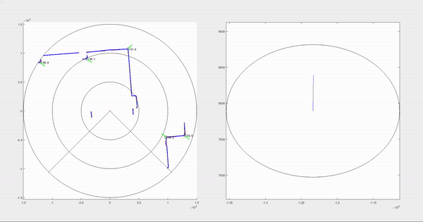
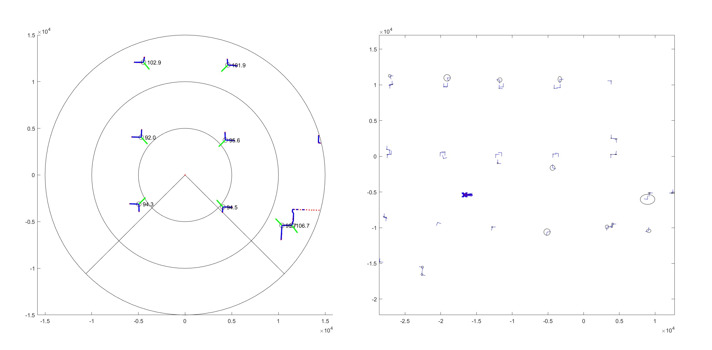

# FAST_SLAM

## Overview

This repository provides a straightforward implementation of the FAST SLAM (Simultaneous Localization and Mapping) algorithm in MATLAB. The algorithm processes 2D LiDAR point cloud data to achieve three primary objectives of a SLAM algorithm:
* Motion Estimation
* Feature Extraction and Matching
* Particle Resampling using Kalman Filter

The SLAM algorithm builds a simple map of a corridor.

## Usage

Clone this repository and run the **slam.m** file to observe the SLAM result.

## Output

**Figure 1:** FAST SLAM algorithm running in real-time

**Figure 2:** Final Output

